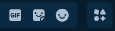

# "sdtos" *(some discord tweaks or something)*
**A Vencord Theme**

## Features

### No Activities Button
Recently, Discord has added a useless button right of the emoji button.
All it does is popup the activities menu in text channels.

So this just removes it.

*this feature has a setting, **--showActivitiesButton**. hide = none, show = flex*

---

### No Help Button
Discord has a help button that just leads to the help center, but who uses it?

This removes it.

*this feature has a setting, **--showHelpButton**. hide = none, show = flex*

---

### Force Emoji on Emoji Button
Discord changed the emoji button to be dynamic.
Every time you hover over it, it changes emoji.

This allows you to force it to a certain emoji.

*this feature has 2 settings, **--custom-emoji-sprite-row, and --custom-emoji-sprite-col**. you can scroll to the bottom of the theme to find the emoji table*